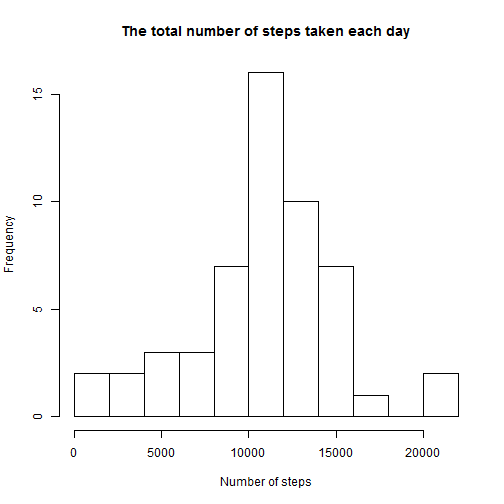
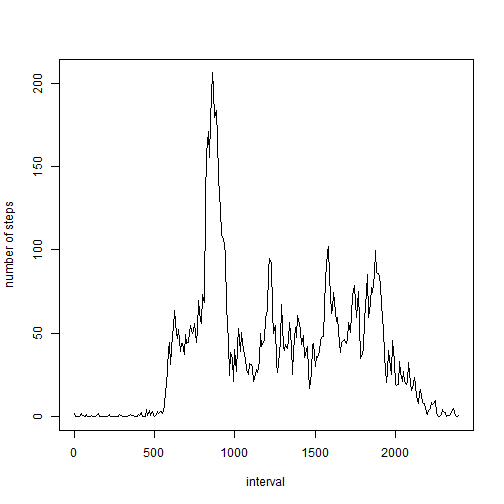
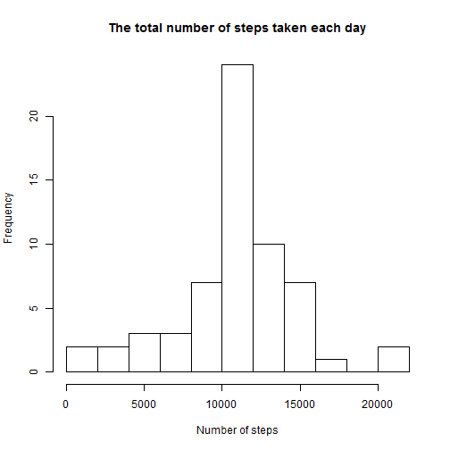
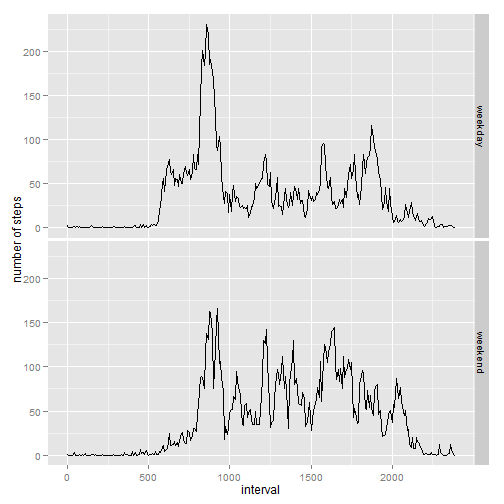

# Reproducible Research: Peer Assessment 1

## Loading and preprocessing the data
 
We read the data from the file `activity.csv` which is located in a zip archive `activity.zip` in the working directory. Then, we convert them to a data frame.

```r
activity <- read.csv(unz("activity.zip", "activity.csv"), stringsAsFactors = FALSE, 
    sep = ",", header = TRUE)
activity <- as.data.frame(activity)
```

This is how our data look like:

```r
str(activity)
```

```
## 'data.frame':	17568 obs. of  3 variables:
##  $ steps   : int  NA NA NA NA NA NA NA NA NA NA ...
##  $ date    : chr  "2012-10-01" "2012-10-01" "2012-10-01" "2012-10-01" ...
##  $ interval: int  0 5 10 15 20 25 30 35 40 45 ...
```


## What is mean total number of steps taken per day?

We compute the **total number of steps each day**. We are asked to omit the missing values. Here we give `NA` to the whole day which has `NA` for some interval:

```r
steps_sums <- aggregate(activity$steps, by = list(date = activity$date), FUN = sum, 
    na.omit = TRUE)
```

In fact we can check that for these days, all the values are `NA`, so it means that the person either kept data for the whole day or didn't do so at all:

```r
NA_dates <- as.character(steps_sums$date[is.na(steps_sums$x)])
for (i in 1:length(NA_dates)) {
    data_aux <- activity[activity$date == NA_dates[i], 1]
    print(paste("date: ", as.character(NA_dates[i]), "; total number of data: ", 
        as.character(length(data_aux)), "; NA's that day: ", as.character(sum(is.na(data_aux)))))
}
```

```
## [1] "date:  2012-10-01 ; total number of data:  288 ; NA's that day:  288"
## [1] "date:  2012-10-08 ; total number of data:  288 ; NA's that day:  288"
## [1] "date:  2012-11-01 ; total number of data:  288 ; NA's that day:  288"
## [1] "date:  2012-11-04 ; total number of data:  288 ; NA's that day:  288"
## [1] "date:  2012-11-09 ; total number of data:  288 ; NA's that day:  288"
## [1] "date:  2012-11-10 ; total number of data:  288 ; NA's that day:  288"
## [1] "date:  2012-11-14 ; total number of data:  288 ; NA's that day:  288"
## [1] "date:  2012-11-30 ; total number of data:  288 ; NA's that day:  288"
```

So the data we are interested in are those from `steps_sums` after deleting days with `NA` sums:

```r
steps_sums <- steps_sums[!is.na(steps_sums$x), ]
```

And the histogram which we are asked to produce is the following:

```r
hist(steps_sums[, 2], breaks = 10, xlab = c("Number of steps"), main = c("The total number of steps taken each day"))
```

 

Now we compute the mean and the median:

```r
steps_mean <- mean(steps_sums[, 2])
steps_median <- median(steps_sums[, 2])
options(scipen = 100)  # to avoid scientific notation when printing the values
```

So the mean is 10767.1887 steps and the median is 10766 steps.

## What is the average daily activity pattern?

We prepare the data without `NA's`:

```r
activity_new <- activity[!is.na(activity$steps), ]
```

We compute the **average number of steps in each of the periods** and make the plot:

```r
interval_means <- aggregate(activity_new$steps, by = list(interval = activity_new$interval), 
    FUN = mean)

plot(interval_means$x, type = "l", xlab = c("interval"), ylab = c("number of steps"), 
    xaxt = "n"  # no axis, we want our own, given below
)
axis(1, at = c(1, 61, 121, 181, 241), labels = c(0, 500, 1000, 1500, 2000))
```

 

Using `interval_means$interval` for the x-axis would cause jumps, because there there is a 5-minute real interval both between (for example) 1050 and 1055 (which correspond to times 10:50 and 10:55), and between 1055 and 1100 (times 10:55 and 11:00). We solved this by putting ticks with interval encodings to their proper place.

The following code **locates the maximum**:

```r
time_max <- interval_means$interval[which.max(interval_means$x)]
```

So the maximum is attained at time coded as 835. This is the time interval from 8:35 AM to 8:40 AM. 

## Imputing missing values

Firstly, we are asked to find **the total number of rows with NAs in the original data set** (which is named `activity` in our case and we are looking for `NA's` in the `steps` data. This is done by the following:

```r
number_of_NAs <- sum(is.na(activity$steps))
```

which gives 2304.

**The strategy for filling the missing values:** We use **the mean of the values from the same interval computed from the days with available data**. Using the data from the same time intervals instead of the data from that day - it is based on the idea that if we don't know the number of steps made between 1:00 a.m. and 1:05 a.m., it is more likely to be close to the number of steps made in this night time during other days, then to the number of steps done during a 5-minute-long interval when averaged from all the day.  

Now, we rewrite `activity` to make it **the data set with missing data filled by the algorithm above**.


```r
# we use the mean stored in 'interval_means' for the same interval, as where
# the 'NA' appears
for (i in 1:nrow(activity)) {
    if (is.na(activity$steps[i])) {
        activity$steps[i] <- interval_means[interval_means$interval == activity$interval[i], 
            2]
    }
}
```


Histogram of steps per day, mean and median value are calculated using the same code as above:


```r
steps_sums_new <- aggregate(activity$steps, by = list(date = activity$date), 
    FUN = sum)
hist(steps_sums_new[, 2], breaks = 10, xlab = c("Number of steps"), main = c("The total number of steps taken each day"))
```

 


```r
steps_mean_new <- mean(steps_sums_new[, 2])
steps_median_new <- median(steps_sums_new[, 2])
options(scipen = 100)  # to avoid scientific notation when printing the values
```


**The effect of inputing the missing data** in this way: the effect on mean (changing from 10767.1887 to 10766.1887) and median (changing from 10766 to 10766.1887) it is minimal, but the probability distribution as shown on histograms has a higher peak now. This is caused by our data, we had 8 days without measurements, they were all replaced by means from the remaining data, so when calculating sums per day, all these 8 days lead the same number.

## Are there differences in activity patterns between weekdays and weekends?

We define a function which returns "weekend" if the given days in a Saturday or Sunday and "weekday" otherwise. By applying it to the column `activity$date` we create **a new factor `day` in our dataset**.


```r
weekend <- c("Saturday", "Sunday")
activity$day <- mapply(function(x) if (any(weekend == weekdays(as.Date(x)))) "weekend" else "weekday", 
    activity$date)
```


Now we compute the averages:


```r
interval_means_days <- aggregate(activity$steps, by = list(interval = activity$interval, 
    day = activity$day), FUN = mean)
```


And plot the required graph:


```r
library(ggplot2)

ggplot(interval_means_days, aes(x = rep(1:288, 2), y = x)) + xlab("interval") + 
    ylab("number of steps") + facet_grid(day ~ .) + geom_line() + scale_x_continuous(breaks = c(1, 
    61, 121, 181, 241), labels = c(0, 500, 1000, 1500, 2000))
```

 

The main difference is, that on weekdays there is a clear peak in the morning.
